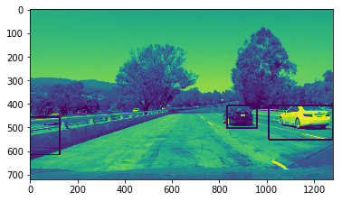
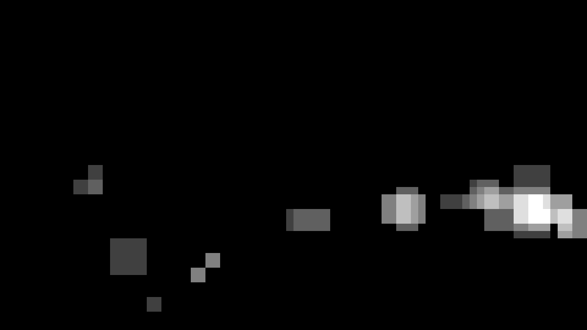

## README

---

**Vehicle Detection Project**

The goals / steps of this project are the following:

* Perform a Histogram of Oriented Gradients (HOG) feature extraction on a labeled training set of images and train a classifier Linear SVM classifier
* Optionally, you can also apply a color transform and append binned color features, as well as histograms of color, to your HOG feature vector. 
* Note: for those first two steps don't forget to normalize your features and randomize a selection for training and testing.
* Implement a sliding-window technique and use your trained classifier to search for vehicles in images.
* Run your pipeline on a video stream (start with the test_video.mp4 and later implement on full project_video.mp4) and create a heat map of recurring detections frame by frame to reject outliers and follow detected vehicles.
* Estimate a bounding box for vehicles detected.

---
### Writeup / README

### Histogram of Oriented Gradients (HOG)

#### 1. Explain how  you extracted HOG features from the training images. In [2]

I read in the test imagery to explore sci-kit's hog api. Initially I ran hog on the entire image.

I explored color ranges and initially built the pipeline using only grayscale values in hog from RGB. While this showed 93% accuracy
in the test set, I found the acutal project video to perform poorly. I then switched to YCrCb colorspace and performed hog on each channel.

I stuck with `orientations=9` and `cells_per_block=(2, 2)` but adjusted `pixels_per_cell=(8, 8)` as I scaled my windows.

#### 2. Explain how you settled on your final choice of HOG parameters. In [2]

I tried various combinations and settled on those which gave me high accuracy. My first run through the pipeline with simply grayscale from
RGB offered 93% accuracy on the test set. Using the YCrCb colorspace and hog features on each channel individually, I reached 95% accuracy.

#### 3. Training In [148]

I trained the Linear SVM classifier by flattening the features of the YCrCb channel hogs . 

### Sliding Window Search

#### 1. Describe how you implemented a sliding window search.  How did you decide what scales to search and how much to overlap windows? In [4]

I chose four windows that were large enough to either capture subparts of a car or focus on far cars. I also chose the sizes to be divisible by 8 in order to maintain the number of hog cells. I did a 50% overlap as it offered acceptable results.

#### 2. Show some examples of test images to demonstrate how your pipeline is working.  What did you do to optimize the performance of your classifier?

I searched three scales in order to capture vehicles of various sizes. As well, I found prediction time to be fairly slow so I buffered the sliding windows to only scan the road area. I still had spurious false positives so I tuned the thresholding of the heatmap to increase accuracy.

---

### Video Implementation

#### 1. Here's a [link to my video result](./project_video_solved.avi)

#### 2. Describe how you implemented some kind of filter for false positives and some method for combining overlapping bounding boxes. In [208]

I recorded the heatmaps of the past 6 frames and stacked them for before thresholding the values for prediction. 

Here's an example result showing the heatmap from a series of frames of video:

### Here are six frames and their corresponding heatmaps:

### Here is the output of the integrated heatmap from all six frames:

### Here the resulting bounding boxes are drawn onto the last frame in the series:

---

### Discussion

#### 1. Briefly discuss any problems / issues you faced in your implementation of this project.  Where will your pipeline likely fail?  What could you do to make it more robust?

I noticed that there's heat on the lane lines which is odd. Likely having more data to train the SVM would improve results. As well, the scales that I search for are pretty hardcoded. Both of these would be solved by using a CNN to generate prediction zones and bounding boxes.

